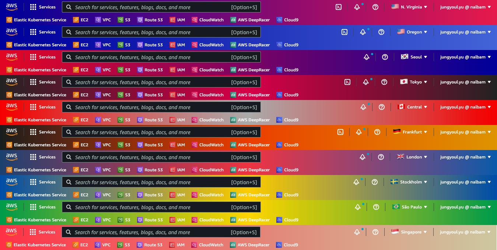

# aws-navbar-extension

> Change navbar color and flag according to AWS region

## How to load

* Open the Extension Management page by navigating to [chrome://extensions](chrome://extensions)
* Enable `Developer Mode` by clicking the toggle switch
* Click the `LOAD UNPACKED` button and select the extension directory
