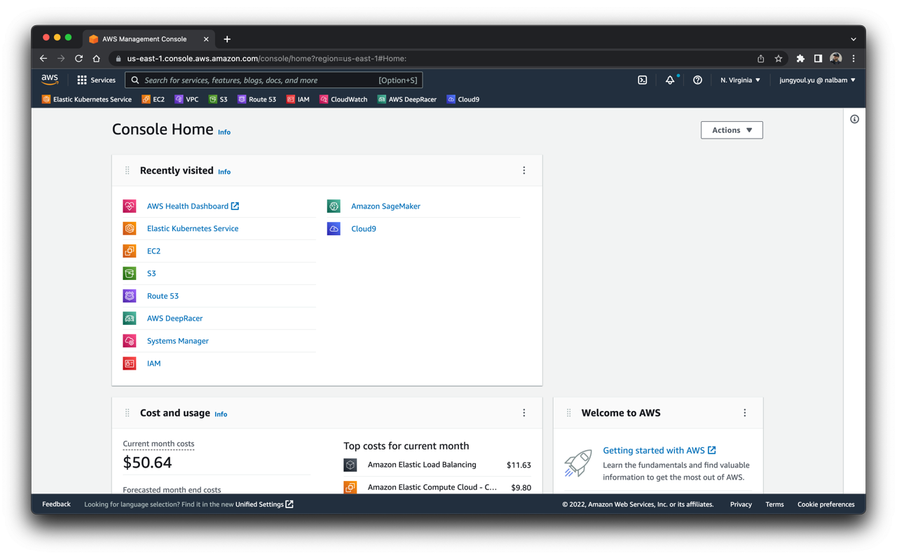
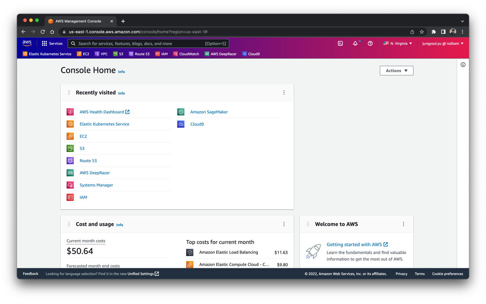

# AWS Colorful Navbar

> Change navbar color and flag according to AWS region

## Features

* Region-based navigation bar color customization
* **Custom color themes per region (2.0)**
* Region flag display next to region selector
* Dark/Light theme support
* Auto-save settings
* Support for all AWS global regions
* Multi-language support (ko, jp)

## Installation

* [Chrome Web Store](https://chrome.google.com/webstore/detail/aws-colorful-navbar/kgifmgnlchjjippdpkblbdlfidcpceme)
* [Microsoft Edge](https://chrome.google.com/webstore/detail/aws-colorful-navbar/kgifmgnlchjjippdpkblbdlfidcpceme)
* [Mozilla Firefox](https://addons.mozilla.org/firefox/addon/aws-colorful-navbar/)

## Configuration

The extension supports the following configuration options:

* `background`: Enable/disable navbar color customization
* `flag`: Enable/disable region flag display
* `customColors`: Custom gradient colors per region (2-4 colors)
* `theme`: Dark/Light mode preference

## Supported Regions

See [flags/README.md](flags/README.md) for a complete list of supported regions and their corresponding flags.

## Screenshots

## Documentation

* [Architecture](docs/ARCHITECTURE.md) - Technical architecture and component details
* [Changelog](docs/CHANGELOG.md) - Version history and release notes

## For Developers

### Installation

* Open the Extension Management page by navigating to `chrome://extensions`
* Enable `Developer Mode` by clicking the toggle switch
* Click the `LOAD UNPACKED` button and select the extension directory

### Development

* Clone the repository
* Make changes to the source code
* Test locally using the unpacked extension
* Run `./package.sh` to create release packages (requires `jq`)
* Submit pull requests for improvements

## Contributing

Contributions are welcome! Please feel free to submit a Pull Request.

## License

This project is licensed under the MIT License - see the LICENSE file for details.
